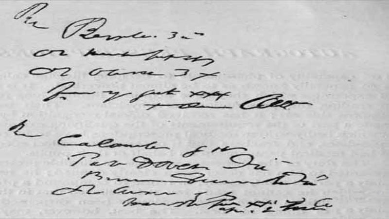
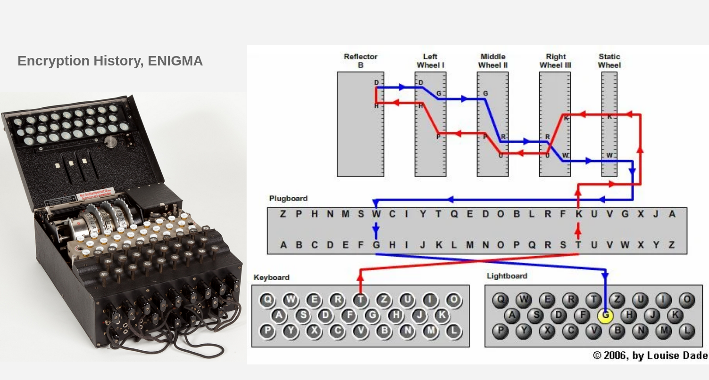

[](https://nodesource.com/products/nsolid) \
[](https://travis-ci.org/joemccann/dillinger)

## 1- Coding

Coding is the process of converting data from/into a format required for a processing needs.
```sh
plain  <---------------(Encoding / Decoding)---------------> coded
```
- Two way process Encoding/Decoding
- Public algorithm / code table
- No key

| Coding | Link |
| ------ | ------ |
| Morse | [Morse Code][Morse] |
| ASCII | [ASCII][ASCII] |
| Base16 | [Base16][Base16] |
| Base64 | [Base64][Base64] |
| Unicode | [Unicode][Unicode] |
| XER | [XER][XER] |
| PEM | [PEM][PEM] |

>hello ------------------------------(Encoding-Morse)---------------> .... . .-.. .-.. ---

>.... . .-.. .-.. --- ---------------(Decoding-Morse)---------------> hello

## 2- Cryption

Cryption is the process of securing data for a processing needs.

- Two way process Encryption/Decryption
- Public/Private algorithm
- key

```sh
plain  <---------------(Encryption / Decryption, key=K)---------------> cipher
```
> hello -------------------------------(Encryption-AES128, key=123)--------------------> f3OghJUQ+Ci/4+A/qjq8UQ==

> f3OghJUQ+Ci/4+A/qjq8UQ== ------------(Decryption-AES128, key=123)--------------------> hello

<br/>
In this sample we combined encryption and encoding.

```sh
plain  ---------------(Encryption, key=K)---------------> cipher ---------------(Encoding)---------------> cipher-coded
```
> hello --(Encryption-AES128, k=123)---> f3OghJUQ+Ci/4+A/qjq8UQ== ---(Encoding-Morse)----> ..-. ...-- --- --. .... .--- ..- --.- .-.-. -.-. .. -..-. ....- .-.-. .- -..-. --.- .--- --.- ---.. ..- --.- -...- -...-

> ..-. ...-- --- --. .... .--- ..- --.- .-.-. -.-. .. -..-. ....- .-.-. .- -..-. --.- .--- --.- ---.. ..- --.- -...- -...- ---------------(Decoding-Morse)---------------> f3OghJUQ+Ci/4+A/qjq8UQ== ---------------(Decryption-AES128, k=123)---------------> hello

<br/>

## 3- Obfuscation
Is the obscuring of the intended meaning of communication by making the message difficult to understand, 
usually with confusing and ambiguous language. [Obfuscation]
[](/Editors-Peak17.jpg/)
<br/>

## 4- Steganography
Is the practice of concealing a message within another message or a physical object. [Steganography]

[](/stego_images.jpg/)
<b1/>

# Cryptography
Cryptography is a method of protecting information and communications through the use of codes, 
so that only those for whom the information is intended can read and process it. [Cryptography]

   - Classic cryptography [...-1970]
   - Computer era         [  1949  ] 
   - Modern cryptography  [1970-...]

### Classic cryptography
   - [Caesar cipher]
   - [Auguste Kerckhoffs Rules]
   - [Enigma machine]
   [](/Enigma.png/)


### Computer era
A Mathematical Theory of Cryptography
Claude E. Shannon — Published September 1945

> In 1948, Claude E. Shannon published the paper [A Mathematical Theory of Communication], which is seen as the foundation of modern information theory. \
> In 1949, Shannon published [Communication Theory of Secrecy Systems] which relates cryptography to information theory, and should be seen as the foundation of modern cryptography. \
> Both papers derive from a technical report, [A Mathematical Theory of Cryptography], written by Shannon in 1945. In this report, Shannon defined, and mathematically proved, perfect secrecy.

### Modern cryptography
   - Goals
      > [Confidentiality], only an authorized recipient should be able to extract the contents of the message from its encrypted form. \
      > [Integrity], the recipient should be able to determine if the message has been altered. \
      > [Authentication], the recipient should be able to verify from the message, the identity of the sender. \
      > [Non-repudiation], the remitter should not be able to deny sending the message.
   - Symmetric-key
   - Asymmetric/Public-key
   - Protocols
   - Cryptographic Hash Functions
   - Tools

<br/>

# Cryptanalysis
Cryptanalysis refers to the process of analyzing information systems in order to understand hidden aspects of the systems. 
Cryptanalysis is used to breach cryptographic security systems and gain access to the contents of encrypted messages, 
even if the cryptographic key is unknown. [Cryptanalysis]

   - Classical Cryptanalysis
   - Implementation Attacks
   - Social Engineering Attacks

## Classical Cryptanalysis
## Implementation Attacks
## Social Engineering Attacks

[//]: # (These are reference links used in the body of this note and get stripped out when the markdown processor does its job. There is no need to format nicely because it shouldn't be seen.)
   [Cryptography]: <https://en.wikipedia.org/wiki/Cryptography>
   [Cryptanalysis]: <https://en.wikipedia.org/wiki/Cryptanalysis>

   [Morse]: <https://en.wikipedia.org/wiki/Morse_code>
   [ASCII]: <https://en.wikipedia.org/wiki/ASCII>
   [Base16]: <https://en.wikipedia.org/wiki/Base16>
   [Base64]: <https://en.wikipedia.org/wiki/Base64>
   [Unicode]: <https://en.wikipedia.org/wiki/Unicode>
   [XER]: <https://en.wikipedia.org/wiki/ASN.1>
   [PEM]: <https://en.wikipedia.org/wiki/Privacy-Enhanced_Mail>

   [Caesar cipher]: <https://en.wikipedia.org/wiki/Caesar_cipher>
   [Auguste Kerckhoffs Rules]: <https://en.wikipedia.org/wiki/Auguste_Kerckhoffs>
   [Enigma machine]: <https://en.wikipedia.org/wiki/Enigma_machine>

   [Steganography]: <https://en.wikipedia.org/wiki/Steganography>
   [Obfuscation]: <https://en.wikipedia.org/wiki/Obfuscation>

   [A Mathematical Theory of Communication]: <https://evervault.com/papers/shannon-communication.pdf>
   [Communication Theory of Secrecy Systems]: <https://evervault.com/papers/shannon-secrecy.pdf>
   [A Mathematical Theory of Cryptography]: <https://evervault.com/papers/shannon.pdf>

   [Confidentiality]: <>
   [Integrity]: <>
   [Authentication]: <>
   [Non-repudiation]: <>
