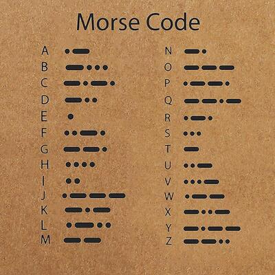
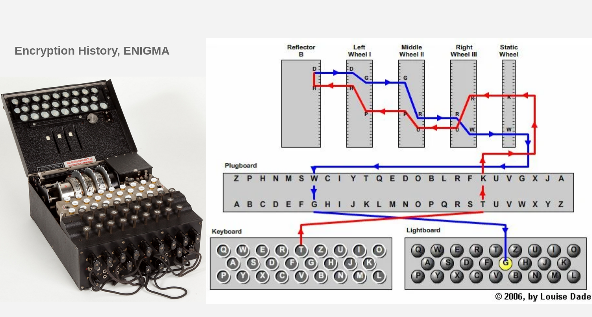

[](https://travis-ci.org/joemccann/dillinger)

# Basic Concept
   - Coding (Encoding / Decoding)
   - Cryption (Encryption / Decryption, key=K)
   - Obfuscation
   - Steganography
   - Insecure / Secure Communication

<br/>

## 1- Coding

Coding is the process of converting data from/into a format required for a processing needs.
```sh
plain  <---------------(Encode / Decode)---------------> coded
```
- Two way process Encoding/Decoding
- Public algorithm / code table
- No key

[](/src/morse.jpg/)
<br/>

| Coding | Link |
| ------ | ------ |
| Morse | [Morse Code][Morse] |
| ASCII | [ASCII][ASCII] |
| Base16 | [Base16][Base16] |
| Base64 | [Base64][Base64] |
| Unicode | [Unicode][Unicode] |
| XER | [XER][XER] |
| PEM | [PEM][PEM] |
<br/>

## 2- Cryption

Cryption is the process of securing data for a processing needs.

- Two way process Encryption/Decryption
- Public/Private algorithm
- key

```sh
plain  <---------------(Encrypt / Decrypt, key=K)---------------> cipher
```
<br/>

## 3- Obfuscation
Is the obscuring of the intended meaning of communication by making the message difficult to understand, 
usually with confusing and ambiguous language. [Obfuscation]
[](/src/Editors-Peak17.jpg/)

<br/>

## 4- Steganography
Is the practice of concealing a message within another message or a physical object. [Steganography]

[](/src/stego_images.jpg/)

<br/>

## 5- Insecure / Secure Communication
- Insecure Communication

```sh
plain ---------------(Encode)---------------> coded ---------------(Send)--------------->
---------------(Recieve)---------> coded ---------------(Decode)---------------> plain
```

>hello --------(Encode-Morse)------> .... . .-.. .-.. --- ---------------(Send)---------------> \
>---------------(Recieve)---------> .... . .-.. .-.. --- ----------(Decode-Morse)---------------> hello

<br/>

- Secure Communication


```sh
plain ---(Encrypt, key=K)----> cipher ----(Encode)----> cipher-coded -----(Send)--->
----(Recieve)---> cipher-coded ---(Decode)----> cipher ---(Decrypt, key=K)----> plain
```

> hello --(Encrypt-AES128, k=123)---> f3OghJUQ+Ci/4+A/qjq8UQ== ---(Encode-Morse)----> ..-. ...-- --- --. .... .--- ..- --.- .-.-. -.-. .. -..-. ....- .-.-. .- -..-. --.- .--- --.- ---.. ..- --.- -...- -...- \
> ..-. ...-- --- --. .... .--- ..- --.- .-.-. -.-. .. -..-. ....- .-.-. .- -..-. --.- .--- --.- ---.. ..- --.- -...- -...- ---------------(Decode-Morse)---------------> f3OghJUQ+Ci/4+A/qjq8UQ== ---------------(Decrypt-AES128, k=123)---------------> hello

<br/>


# Cryptography
The word cryptography comes from the Greek words kryptos meaning hidden and graphein meaning writing.
Cryptography is the study of hidden writing, or the science of encrypting and decrypting text and messages.

Cryptography is a method of protecting information and communications, 
so that only those for whom the information is intended can read and process it. [Cryptography]

   - Classic cryptography [...-WWII]
   - Computer era         [  1949  ] 
   - Modern cryptography  [1970-...]

<br/>

### Classic cryptography
The main classical cipher types are transposition ciphers, which rearrange the order of letters in a message (e.g., 'hello world' becomes 'ehlol owrdl' in a trivially simple rearrangement scheme), and substitution ciphers, which systematically replace letters or groups of letters with other letters or groups of letters (e.g., 'fly at once' becomes 'gmz bu podf' by replacing each letter with the one following it in the Latin alphabet)

   - [Caesar cipher]
   - [Auguste Kerckhoffs Rules]
   - [Enigma machine]
   [](/src/Enigma.png/)
   [Enigma Online Emulator]

<br/>

### Computer era
A Mathematical Theory of Cryptography
Claude E. Shannon — Published September 1945

> In 1948, Claude E. Shannon published the paper [A Mathematical Theory of Communication], which is seen as the foundation of modern information theory. \
> In 1949, Shannon published [Communication Theory of Secrecy Systems] which relates cryptography to information theory, and should be seen as the foundation of modern cryptography. \
> Both papers derive from a technical report, [A Mathematical Theory of Cryptography], written by Shannon in 1945. In this report, Shannon defined, and mathematically proved, perfect secrecy.

<br/>

### Modern cryptography
The main purpose of cryptography is to protect data transmitted or perform secure communication in the likely presence of an adversary.
   - Applications:
      > [Military] \
      > [Intelligence agency] \
      > [Web] https \
      > [Email] \
      > [Messanger] WhatsApp \
      > [Cryptocurrency] \
      > [Digital Signatures] \
      > [IoT]
   - Goals
      > [Confidentiality], the information cannot be understood by anyone for whom it was unintended. \
      > [Integrity], the information cannot be altered in storage or transit between sender and intended receiver without the alteration being detected. \
      > [Authentication], the sender and receiver can confirm each other’s identity and the origin/destination of the information. \
      > [Non-repudiation], the creator/sender of the information cannot deny at a later stage his or her intentions in the creation or transmission of the information.
   - Algorithms
      > Symmetric or Secret-key \
      > Asymmetric or Public-key
   - Protocols
      > SSH \
      > SSL-TLS \
      > Kerberos \
      > IPSec
   - Cryptographic Hash Functions
      > Hash \
      > MAC \
      > HMAC
   - Tools
      > OpenSSH \
      > OpenSSL \
      > GPG

<br/>

### Symmetric
Are algorithms for cryptography that use the same cryptographic keys for both the encryption of plaintext and the decryption of ciphertext.
[](/src/Symmetric-Encryption.png/)

- Stream
   - Classic
      - Substitution: caesar-cipher, Shift-cipher, vigenère-cipher
      - Transposition
   - LFSR
   - OTP
   - RC4
- Block
   - [DES], 1976
   - [AES], 2001 
   - 3DES

<br/>

### Asymmetric-key
Asymmetric encryption uses two keys to encrypt and decrypt a plain text.  
[](/src/Asymmetric-Encryption.png/)

- Diffie-Hellman
- [RSA]
- DSA
- Elliptic-Curve

<br/>
<br/>

# Tools
## [openssl] 
a robust, commercial-grade, full-featured toolkit for general-purpose cryptography and secure communication.

- Obtaining the List of Supported Suites
```sh
openssl ciphers -v 'ALL:COMPLEMENTOFALL'
```

- Performance
```sh
openssl speed rc4 aes rsa ecdh sha
```

- Base64 Encoding Decoding text
```sh
echo -n 'This should be encoded' | openssl base64
echo VGhpcyBzaG91bGQgYmUgZW5jb2RlZA== | openssl base64 -d
```

- Base64 Encoding Decoding file
```sh
openssl base64 -in letter.txt -out .letter.base64.coded.txt
openssl base64 -d -in .letter.base64.coded.txt -out .letter.base64.decoded.txt
```

# Cryptanalysis
Cryptanalysis refers to the process of analyzing information systems in order to understand hidden aspects of the systems. 
Cryptanalysis is used to breach cryptographic security systems and gain access to the contents of encrypted messages, 
even if the cryptographic key is unknown. [Cryptanalysis]

   - Classical Cryptanalysis
   - Implementation Attacks
   - Social Engineering Attacks

## Classical Cryptanalysis
## Implementation Attacks
## Social Engineering Attacks

[//]: # (These are reference links used in the body of this note and get stripped out when the markdown processor does its job. There is no need to format nicely because it shouldn't be seen.)
   [Cryptography]: <https://en.wikipedia.org/wiki/Cryptography>
   [Cryptanalysis]: <https://en.wikipedia.org/wiki/Cryptanalysis>

   [Morse]: <https://en.wikipedia.org/wiki/Morse_code>
   [ASCII]: <https://en.wikipedia.org/wiki/ASCII>
   [Base16]: <https://en.wikipedia.org/wiki/Base16>
   [Base64]: <https://en.wikipedia.org/wiki/Base64>
   [Unicode]: <https://en.wikipedia.org/wiki/Unicode>
   [XER]: <https://en.wikipedia.org/wiki/ASN.1>
   [PEM]: <https://en.wikipedia.org/wiki/Privacy-Enhanced_Mail>

   [Caesar cipher]: <https://en.wikipedia.org/wiki/Caesar_cipher>
   [Auguste Kerckhoffs Rules]: <https://en.wikipedia.org/wiki/Auguste_Kerckhoffs>
   [Enigma machine]: <https://en.wikipedia.org/wiki/Enigma_machine>
   [Enigma Online Emulator]: <https://www.101computing.net/enigma/enigma-M3.html>

   [Steganography]: <https://en.wikipedia.org/wiki/Steganography>
   [Obfuscation]: <https://en.wikipedia.org/wiki/Obfuscation>

   [A Mathematical Theory of Communication]: <https://evervault.com/papers/shannon-communication.pdf>
   [Communication Theory of Secrecy Systems]: <https://evervault.com/papers/shannon-secrecy.pdf>
   [A Mathematical Theory of Cryptography]: <https://evervault.com/papers/shannon.pdf>

   [Military]: <>
   [Intelligence agency]: <>
   [Web]: <>
   [Email]: <>
   [Messanger]: <>
   [Cryptocurrency]: <>
   [Digital Signatures]: <>
   [IoT]: <>
   
   [Confidentiality]: <>
   [Integrity]: <>
   [Authentication]: <>
   [Non-repudiation]: <>

   [DES]: <https://en.wikipedia.org/wiki/Data_Encryption_Standard>
   [AES]: <https://en.wikipedia.org/wiki/Advanced_Encryption_Standard>
   [RSA]: <https://en.wikipedia.org/wiki/RSA_(cryptosystem)>
   [openssl]: <https://www.openssl.org/>
