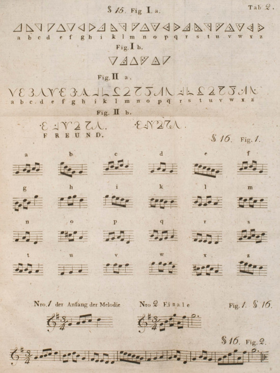
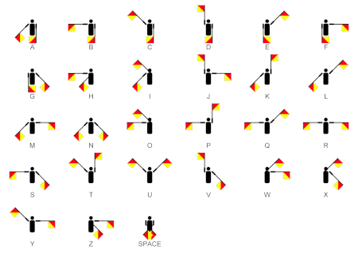
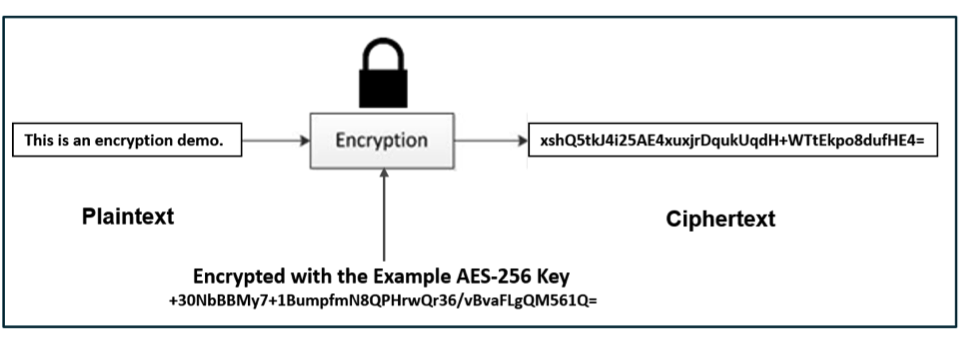
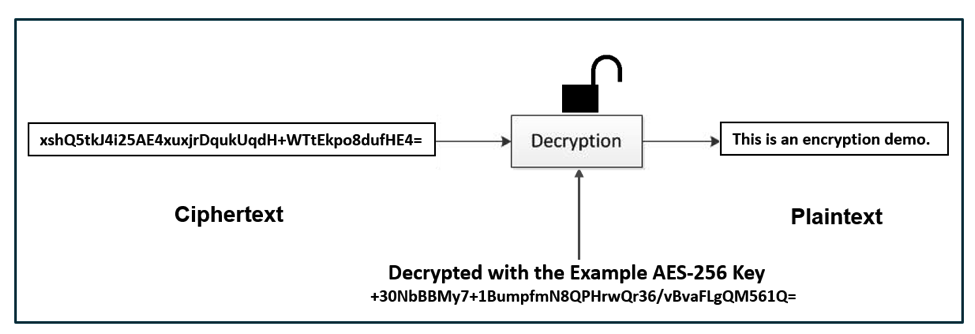
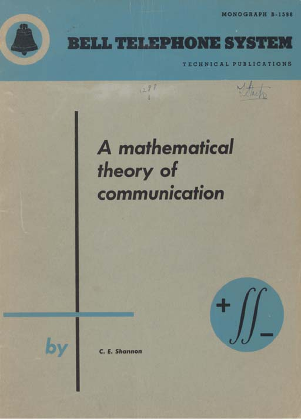
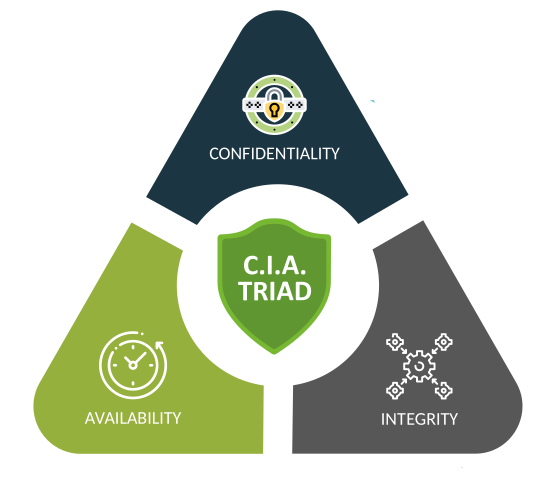

[](https://travis-ci.org/joemccann/dillinger)


## Cryptography, What are we looking for
   - Secure Communication Over Insecure Channels


   ```sh
   Alice <------------------------------------------------------------------------> Bob
                                             |
                                             |
                                             |
                                             |
                                             v
                                          Mallory
   ```

<br/>

# Concept
   - Obfuscation
   - Steganography
   - Coding
   - Encryption
   - Hash Functions

# Process
   - Communication
   - Cryptography
   - Cryptanalysis


<br/>


## Obfuscation
Is the obscuring of the intended meaning of communication by making the message difficult to understand, 
usually with confusing and ambiguous language. [Obfuscation]  
[](/src/Editors-Peak17.jpg/)

<br/>

## Steganography
Is the practice of concealing a message within another message or a physical object. [Steganography]

[](/src/music-code.jpg/)

[](/src/stego_images.jpg/)


## Coding

Coding is the process of converting data from/into a format required for a processing needs.
```sh
plain  <---------------(Encode / Decode)---------------> coded
```
- Two way process Encoding/Decoding
- Public algorithm / code table
- No key

[](/src/morse.jpg/)
<br/>

[](/src/Semaphore_Signals_A-Z.jpg/)
<br/>

| Coding | Sample | Link |
| ------ | ------ |------ |
| Morse | .... . .-.. .-.. --- | [Morse Code][Morse] |
| Flag semaphore |  | [Flag semaphore][Flag semaphore] |
| ASCII | 0110100001100101011011000110110001101111 | [ASCII][ASCII] |
| Base16 | 68656c6c6f | [Base16][Base16] |
| Base64 | aGVsbG8= | [Base64][Base64] |
<br/>

## Encryption

Encryption is the process of securing data for a processing needs.

- Two way process Encryption/Decryption
- Public/Private algorithm
- key

```sh
plain  <---------------(Encrypt / Decrypt, key=K)---------------> cipher
```
[](/src/encryption.png/)
<br/>

[](/src/encryption-encrypt.png/)
<br/>

[](/src/encryption-decrypt.png/)
<br/>

<br/>

## Hash Functions
A cryptographic hash function (CHF) is a mathematical algorithm that maps data of an arbitrary size (often called the "message") to a bit array of a fixed size (the "hash value", "hash", or "message digest"). It is a one-way function, that is, a function for which it is practically infeasible to invert or reverse the computation.

<br/>

[](/src/hash.jpg/)

<br/>

| Algorithm | Sample | Link |
| ------ | ------ |------ |
| MD5| b1946ac92492d2347c6235b4d2611184 | [MD5] |
| SHA-1 | f572d396fae9206628714fb2ce00f72e94f2258f | [SHA-1] |
| SHA-2 | 5891b5b522d5df086d0ff0b110fbd9d21bb4fc7163af34d08286a2e846f6be03 | [SHA-2] |
| SHA-3 | 1d0f284efe3edea4b9ca3bd514fa134b17eae361ccc7a1eefeff801b9bd6604e01f21f6bf249ef030599f0c218f2ba8c | [SHA-3] |


   - cryptographic hash function must be deterministic.
   - it is quick to compute the hash value for any given message.
   - it is infeasible to generate a message that yields a given hash value.
   - it is infeasible to find two different messages with the same hash value.
   - a small change to a message should change the hash value so extensively that a new hash value appears uncorrelated with the old hash value (avalanche effect).

| Input | Algorithm | Hash |
| ------ | ------ |------ |
| my name is masoud bolhassani, from chenarestan. | SHA-1 | 196cd8dab8e773c68be35016c0c1d83e2a86701d |
| my name is masoud bolhasani, from chenarestan. | SHA-1 | 239d4a179184852114841fa77c8640511e47bfd5 |

<br/>

## Insecure / Secure Communication

- Insecure Communication

```sh
plain ---------------(Encode)---------------> coded ---------------(Send)--------------->


---------------(Recieve)---------> coded ---------------(Decode)---------------> plain
```

>hello --------(Encode-Morse)------> .... . .-.. .-.. --- ---------------(Send)--------------->


>---------------(Recieve)---------> .... . .-.. .-.. --- ----------(Decode-Morse)---------------> hello

<br/>

- Secure Communication


```sh
plain ---(Encrypt, key=K)----> cipher ----(Encode)----> cipher-coded -----(Send)--->


----(Recieve)---> cipher-coded ---(Decode)----> cipher ---(Decrypt, key=K)----> plain
```

> hello --(Encrypt-AES128, k=123)---> f3OghJUQ+Ci/4+A/qjq8UQ== ---(Encode-Morse)----> ..-. ...-- --- --. .... .--- ..- --.- .-.-. -.-. .. -..-. ....- .-.-. .- -..-. --.- .--- --.- ---.. ..- --.- -...- -...- \


> ..-. ...-- --- --. .... .--- ..- --.- .-.-. -.-. .. -..-. ....- .-.-. .- -..-. --.- .--- --.- ---.. ..- --.- -...- -...- ---------------(Decode-Morse)---------------> f3OghJUQ+Ci/4+A/qjq8UQ== ---------------(Decrypt-AES128, k=123)---------------> hello

<br/>


## Cryptography
Cryptography is a method of protecting information and communications, so that only those for whom the information is intended can read and process it. [Cryptography]

   - Classic cryptography [... - WWII]
   - Computer era         [1945 - 1970]
   - Modern cryptography  [1970 - ...]

<br/>

### Classic cryptography [... - WWII]
The main classical cipher types are transposition ciphers, which rearrange the order of letters in a message (e.g., 'hello world' becomes 'ehlol owrdl' in a trivially simple rearrangement scheme), and substitution ciphers, which systematically replace letters or groups of letters with other letters or groups of letters (e.g., 'fly at once' becomes 'gmz bu podf' by replacing each letter with the one following it in the Latin alphabet)

   - [Caesar cipher]
   - [Auguste Kerckhoffs Rules]
   - [Enigma machine]
   [](/src/Enigma.png/)
   [Enigma Online Emulator]

<br/>

### Computer era [1945 - 1970]
A Mathematical Theory of Cryptography
Claude E. Shannon — Published September 1945

> In 1948, Claude E. Shannon published the paper [A Mathematical Theory of Communication], which is seen as the foundation of modern information theory. \
> In 1949, Shannon published [Communication Theory of Secrecy Systems] which relates cryptography to information theory, and should be seen as the foundation of modern cryptography.

> Both papers derive from a technical report, [A Mathematical Theory of Cryptography], written by Shannon in 1945. In this report, Shannon defined, and mathematically proved, perfect secrecy.  
[](/src/Shannon_Claude_E_1948_A_Mathematical_Theory_of_Communication_offprint.jpg/)

<br/>

### Modern cryptography [1970 - ...]
   - Goals
      > Confidentiality \
      > Integrity \
      > Authentication \
      > Non-repudiation
   - Encryption Algorithms Algorithms
      > Symmetric \
      > Asymmetric
   - Cryptographic Hash Functions
      > Hash \
      > MAC \
      > HMAC
   - Applications:
      > Military \
      > Intelligence Agency \
      > Web \
      > Email \
      > Messanger \
      > Cryptocurrency \
      > Digital Signatures \
      > IoT     
   - Protocols
      > SSH \
      > SSL-TLS \
      > Kerberos \
      > IPSec   
   - Tools
      > OpenSSH \
      > OpenSSL \
      > GPG

<br/>

### Goals
 In Cryptography, an Adversary is a malicious entity, which aims to retrieve precious information or data thereby undermining the principles of information security. \
 Data Confidentiality, Data Integrity, Authentication and Non-repudiation are core principles of modern-day cryptography. \
[](/src/cia-triad.png/)
- [Confidentiality], the information cannot be understood by anyone for whom it was unintended.
- [Integrity], the information cannot be altered in storage or transit between sender and intended receiver without the alteration being detected.
- [Authentication], the sender and receiver can confirm each other’s identity and the origin/destination of the information.
- [Non-repudiation], the creator/sender of the information cannot deny at a later stage his or her intentions in the creation or transmission of the information. 

### Algorithms: Symmetric
Are algorithms for cryptography that use the same cryptographic keys for both the encryption of plaintext and the decryption of ciphertext.
[](/src/Symmetric-Encryption.png/)

- Stream
   - Classic
      - Substitution: caesar-cipher, Shift-cipher, vigenère-cipher
      - Transposition
   - LFSR
   - OTP
   - RC4
- Block
   - [DES], 1976
   - [AES], 2001 
   - 3DES

<br/>

### Algorithms: Asymmetric
Asymmetric encryption uses two keys to encrypt and decrypt a plain text.  
[](/src/Asymmetric-Encryption.png/)

- Diffie-Hellman
- [RSA]
- DSA
- Elliptic-Curve


<br/>

# Tools
## [openssl] 
a robust, commercial-grade, full-featured toolkit for general-purpose cryptography and secure communication.

- Obtaining the List of Supported Suites
```sh
openssl ciphers -v 'ALL:COMPLEMENTOFALL'
```

- Performance
```sh
openssl speed rc4 aes rsa ecdh sha
```

- Base64 Encoding Decoding text
```sh
echo -n 'This should be encoded' | openssl base64
echo VGhpcyBzaG91bGQgYmUgZW5jb2RlZA== | openssl base64 -d
```

- Base64 Encoding Decoding file
```sh
openssl base64 -in letter.txt -out .letter.base64.coded.txt
openssl base64 -d -in .letter.base64.coded.txt -out .letter.base64.decoded.txt
```

# Cryptanalysis
Cryptanalysis refers to the process of analyzing information systems in order to understand hidden aspects of the systems. 
Cryptanalysis is used to breach cryptographic security systems and gain access to the contents of encrypted messages, 
even if the cryptographic key is unknown. [Cryptanalysis]

   - Classical Cryptanalysis
   - Implementation Attacks
   - Social Engineering Attacks

<br/>

[//]: # (These are reference links used in the body of this note and get stripped out when the markdown processor does its job. There is no need to format nicely because it shouldn't be seen.)
   [Cryptography]: <https://en.wikipedia.org/wiki/Cryptography>
   [Cryptanalysis]: <https://en.wikipedia.org/wiki/Cryptanalysis>

   [Morse]: <https://en.wikipedia.org/wiki/Morse_code>
   [Flag semaphore]: <https://en.wikipedia.org/wiki/Flag_semaphore>
   [ASCII]: <https://en.wikipedia.org/wiki/ASCII>
   [Base16]: <https://en.wikipedia.org/wiki/Base16>
   [Base64]: <https://en.wikipedia.org/wiki/Base64>
   [Unicode]: <https://en.wikipedia.org/wiki/Unicode>
   [XER]: <https://en.wikipedia.org/wiki/ASN.1>
   [PEM]: <https://en.wikipedia.org/wiki/Privacy-Enhanced_Mail>

   [Caesar cipher]: <https://en.wikipedia.org/wiki/Caesar_cipher>
   [Auguste Kerckhoffs Rules]: <https://en.wikipedia.org/wiki/Auguste_Kerckhoffs>
   [Enigma machine]: <https://en.wikipedia.org/wiki/Enigma_machine>
   [Enigma Online Emulator]: <https://www.101computing.net/enigma/enigma-M3.html>

   [Steganography]: <https://en.wikipedia.org/wiki/Steganography>
   [Obfuscation]: <https://en.wikipedia.org/wiki/Obfuscation>

   [A Mathematical Theory of Communication]: <https://evervault.com/papers/shannon-communication.pdf>
   [Communication Theory of Secrecy Systems]: <https://evervault.com/papers/shannon-secrecy.pdf>
   [A Mathematical Theory of Cryptography]: <https://evervault.com/papers/shannon.pdf>

   [MD5]: <https://en.wikipedia.org/wiki/MD5>
   [SHA-1]: <https://en.wikipedia.org/wiki/SHA-1>
   [SHA-2]: <https://en.wikipedia.org/wiki/SHA-2>
   [SHA-3]: <https://en.wikipedia.org/wiki/SHA-3>


   [Military]: <>
   [Intelligence agency]: <>
   [Web]: <>
   [Email]: <>
   [Messanger]: <>
   [Cryptocurrency]: <>
   [Digital Signatures]: <>
   [IoT]: <>
   
   [Confidentiality]: <>
   [Integrity]: <>
   [Authentication]: <>
   [Non-repudiation]: <>

   [DES]: <https://en.wikipedia.org/wiki/Data_Encryption_Standard>
   [AES]: <https://en.wikipedia.org/wiki/Advanced_Encryption_Standard>
   [RSA]: <https://en.wikipedia.org/wiki/RSA_(cryptosystem)>
   [openssl]: <https://www.openssl.org/>
